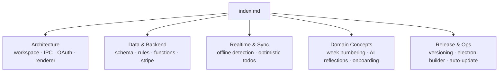

# Agent Contribution Report

## Bootstrap the project wiki from zero with architecture documentation

### 🔴 Current behavior

```
divergent-todos/
├── CLAUDE.md                  ← only structured doc (build/dev commands)
├── functions/CLAUDE.md        ← only functions conventions doc
├── README.md                  ← minimal overview
├── plans/
│   └── remove-csb.md          ← one untracked plan file
└── (no .wiki/ folder)
```

Developers must read raw source files, grep for patterns, and piece together how subsystems connect — there is no single place to understand architecture decisions, data-flow, or operational runbooks.

---

### 🟢 New behavior

```
divergent-todos/
└── .wiki/
    ├── index.md                              ← table of contents with [[slug]] links
    ├── workspace-layout.md
    ├── electron-security-and-ipc.md
    ├── desktop-oauth-flow.md
    ├── firestore-schema.md
    ├── firestore-security-rules.md
    ├── todos-realtime-and-offline.md
    ├── optimistic-todos-and-fractional-indexing.md
    ├── sequential-weeks.md
    ├── activity-and-ai-reflections.md
    ├── context-interface-pattern.md
    ├── stripe-subscriptions.md
    └── release-and-auto-update.md
```

Each page carries YAML front matter (`title`, `tags`, `sources`, `updated: 2026-04-16`) and uses `[[slug]]` cross-references. Coverage spans four concern areas:



> **Note:** No files were written to disk. All 13 pages were delivered as copyable markdown blocks for the developer to paste. The `.wiki/` directory does not yet exist in the repository.

---

### 🤔 Assumptions

- No pre-existing wiki pages needed reconciling — the directory was absent entirely, so all pages were created net-new with `updated: 2026-04-16`.
- `CLAUDE.md` and `functions/CLAUDE.md` were treated as authoritative seed material (not supplementary).
- The branch `remove-csb` / plan `remove-csb.md` was treated as a separate, in-progress concern (cosmetic rename); it was flagged but not incorporated into any wiki page.
- Wiki pages were scoped to knowledge useful to a developer joining the project — operational runbooks and public-facing docs were not a goal.

---

### 🧠 Decisions

- Used `[[slug]]` wiki-link syntax for cross-references rather than relative Markdown paths, keeping pages portable across wiki hosts.
- Collapsed the AI reflections pipeline (batch jobs, polling, OpenAI, Resend) into a single page (`activity-and-ai-reflections.md`) rather than one page per Cloud Function, because the consumer-visible concept is unified.
- Placed the `context-interface-pattern.md` page as standalone architecture documentation rather than burying it in the `cloud-functions.md` overview, because it is an enforced convention affecting every new functions contributor.
- Included a `testing.md` entry in the index even though no dedicated page was drafted — left as a placeholder for future expansion.
- The `desktop-oauth-flow.md` sequence diagram was rendered as ASCII/Mermaid-style text rather than prose because the three-leg OAuth dance is hard to follow linearly.

---

### 🔄 Discussions

- After initial exploration Claude planned to note the Context Interface Pattern inside the cloud-functions overview, then reversed course and gave it a dedicated page (`context-interface-pattern.md`) once the depth of `functions/CLAUDE.md` became clear.

---

### 🧪 Testing

- Not tested — no files were written; the session produced markdown blocks for manual copy-paste. No wiki renderer, link validator, or front-matter linter was run.

---

### 📁 References

- [plans/remove-csb.md](plans/remove-csb.md)
- [package.json](package.json)
- [pnpm-workspace.yaml](pnpm-workspace.yaml)
- [apps/web/package.json](apps/web/package.json)
- [apps/web/src/App.tsx](apps/web/src/App.tsx)
- [apps/web/src/firebase/index.ts](apps/web/src/firebase/index.ts)
- [apps/web/src/firebase/types/todo.ts](apps/web/src/firebase/types/todo.ts)
- [apps/web/src/firebase/types/profile.ts](apps/web/src/firebase/types/profile.ts)
- [apps/web/src/firebase/types/activity.ts](apps/web/src/firebase/types/activity.ts)
- [apps/web/src/firebase/types/reflection.ts](apps/web/src/firebase/types/reflection.ts)
- [apps/web/firestore.rules](apps/web/firestore.rules)
- [apps/web/firestore.indexes.json](apps/web/firestore.indexes.json)
- [apps/web/firebase.json](apps/web/firebase.json)
- [apps/web/vite.config.ts](apps/web/vite.config.ts)
- [apps/web/src/hooks/useAuthentication.ts](apps/web/src/hooks/useAuthentication.ts)
- [apps/web/src/hooks/useTodosData.ts](apps/web/src/hooks/useTodosData.ts)
- [apps/web/src/hooks/useTodos.ts](apps/web/src/hooks/useTodos.ts)
- [apps/web/src/hooks/useFirestoreConnection.ts](apps/web/src/hooks/useFirestoreConnection.ts)
- [apps/web/src/hooks/useTodoOperations.ts](apps/web/src/hooks/useTodoOperations.ts)
- [apps/web/src/hooks/usePendingTodos.ts](apps/web/src/hooks/usePendingTodos.ts)
- [apps/web/src/utils/activity.ts](apps/web/src/utils/activity.ts)
- [apps/web/src/utils/shadowTodos.ts](apps/web/src/utils/shadowTodos.ts)
- [apps/web/src/TopBar/index.tsx](apps/web/src/TopBar/index.tsx)
- [apps/web/src/contexts/OnboardingContext.tsx](apps/web/src/contexts/OnboardingContext.tsx)
- [apps/desktop/src/main/main.ts](apps/desktop/src/main/main.ts)
- [apps/desktop/src/preload/preload.ts](apps/desktop/src/preload/preload.ts)
- [apps/desktop/src/types/ipc.d.ts](apps/desktop/src/types/ipc.d.ts)
- [apps/desktop/electron-builder.config.js](apps/desktop/electron-builder.config.js)
- [apps/desktop/electron.vite.config.ts](apps/desktop/electron.vite.config.ts)
- [functions/src/index.ts](functions/src/index.ts)
- [functions/src/generateWeeklySummaries.ts](functions/src/generateWeeklySummaries.ts)
- [functions/README.md](functions/README.md)
- [README.md](README.md)
