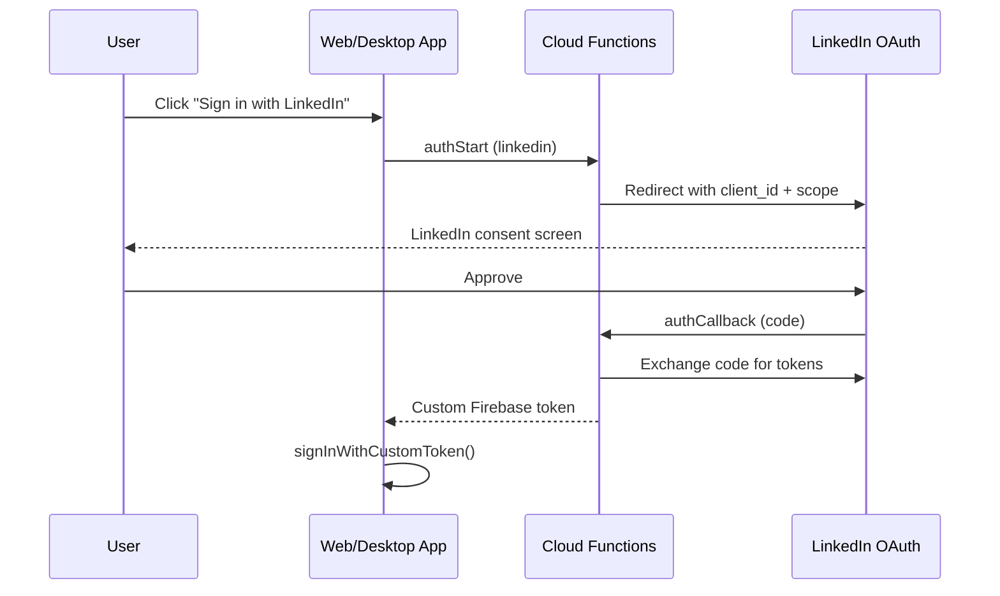

# Agent Contribution Report

## [LinkedIn sign-in option for web and desktop users]

### 🔴 Current behavior

```
┌─────────────────────────────────┐
│         Sign In                 │
│                                 │
│  [  Sign in with Google  ]      │
│                                 │
│  (no LinkedIn option)           │
└─────────────────────────────────┘
```

### 🟢 New behavior

> ⚠️ **Not implemented** — this session ended at the research and planning stage. No code was written or changed. The intended end state would be:

```
┌─────────────────────────────────┐
│         Sign In                 │
│                                 │
│  [  Sign in with Google  ]      │
│  [  Sign in with LinkedIn ]     │
│                                 │
└─────────────────────────────────┘
```



### 🤔 Assumptions

- LinkedIn's OIDC discovery endpoint (`/oauth/.well-known/openid-configuration`) is non-standard and incompatible with Firebase's built-in OIDC provider — confirmed via web research
- The custom Cloud Functions pattern already used for Google sign-in (`authStart` / `authCallback` / `authExchange`) is the correct pattern to replicate for LinkedIn
- Both the web client and the Electron desktop app would share the same Cloud Functions endpoints, matching the existing Google implementation

### 🧠 Decisions

- **Rejected** Firebase's native OIDC provider because LinkedIn's discovery URL is non-standard and Firebase cannot auto-configure from it
- **Chose** custom Cloud Functions (mirroring the existing Google OAuth flow) as the implementation path — same `authStart` / `authCallback` flow, different provider credentials

### 🔄 Discussions

- Initial research considered using Firebase's built-in OIDC support; this was ruled out mid-session after confirming the LinkedIn discovery URL incompatibility

### 🧪 Testing

- Not tested — no implementation was produced; the session ended while writing the plan document

### 📁 References

- [apps/web/src/firebase/index.ts](apps/web/src/firebase/index.ts)
- [apps/web/src/hooks/useSignIn.ts](apps/web/src/hooks/useSignIn.ts)
- [apps/web/src/hooks/useLinkAnonymousAccount.ts](apps/web/src/hooks/useLinkAnonymousAccount.ts)
- [apps/web/src/LandingPage.tsx](apps/web/src/LandingPage.tsx)
- [apps/web/src/AuthModal.tsx](apps/web/src/AuthModal.tsx)
- [apps/desktop/src/main/main.ts](apps/desktop/src/main/main.ts)
- [functions/src/index.ts](functions/src/index.ts)
