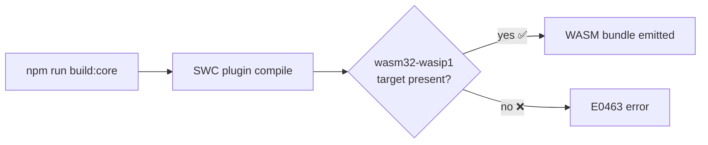

# Agent Contribution Report

## Type component children without leaving the Rask namespace

### 🔴 Current behavior

The `Rask` global namespace exposed event types but had no type for component children, forcing developers to import directly from Inferno or use `any`:

```tsx
// Before — no Rask-namespaced children type; must reach outside the namespace
import { InfernoNode } from "inferno";

interface Props {
  children: InfernoNode;   // had to import from inferno directly
  // — or —
  children: any;           // gave up on type safety
}

function Card({ children }: Props) {
  return <div class="card">{children}</div>;
}
```

### 🟢 New behavior

Two aliases are now available inside the `Rask` namespace, mirroring the `React.ReactNode` pattern:

```tsx
// After — children typed entirely within the Rask namespace
interface Props {
  children: Rask.Children;   // primary alias (analogous to React.ReactNode)
  // — or —
  children: Rask.RaskNode;   // convenience alias, identical type
}

function Card({ children }: Props) {
  return <div class="card">{children}</div>;
}
```

Both resolve to Inferno's `InfernoNode`, which accepts:

```
InfernoElement | string | number | boolean | null | undefined | Array<InfernoNode> | {}
```

### 🤔 Assumptions
- `InfernoNode` is the correct Inferno equivalent of `React.ReactNode` — it is the widest renderable-value type Inferno exposes.
- `InfernoNode` was already imported in `types.ts`; no new import was needed.
- `Rask.RaskNode` is a pure convenience alias — it carries no semantic difference from `Rask.Children`.

### 🧠 Decisions
- Named the primary alias `Rask.Children` to mirror the React ecosystem convention (`React.ReactNode` is often expressed as `React.ReactNode` / `React.Children`-style naming).
- Added `Rask.RaskNode` as a second alias explicitly for ergonomic convenience ("namespace feels more native when reading `Rask.RaskNode`").

### 🧪 Testing
- Not tested — no test runs observed. The change is purely additive type-level; it cannot cause a runtime regression.

### 📁 References
- [packages/core/src/types.ts](packages/core/src/types.ts)

---

## Install Rust and WASM target to unblock core package build

### 🔴 Current behavior

Running the core package build failed immediately because Rust was not installed:

```
sh: cargo: command not found
```

After installing Rust, the WASM compilation step then failed:

```
error[E0463]: can't find crate for `std`
  = note: the `wasm32-wasip1` target may not be installed
  = help: consider downloading the target with `rustup target add wasm32-wasip1`
```

### 🟢 New behavior



Both blockers are resolved:
- `cargo 1.94.1` is on the PATH after sourcing `~/.cargo/env`.
- `wasm32-wasip1` cross-compilation target is registered via `rustup target add wasm32-wasip1`.

Developers can now build the core package (which includes an SWC plugin that compiles to WebAssembly).

### 🤔 Assumptions
- The core package uses an SWC plugin that must be compiled to WASM (`wasm32-wasip1`) at build time; Rust's default installation only includes the native target (`aarch64-apple-darwin`).
- A one-time `source "$HOME/.cargo/env"` (or terminal restart) is required for `cargo` to appear on the PATH in existing shells.

### 🧠 Decisions
- Used the official `rustup` installer (`sh.rustup.rs`) with non-interactive flag (`-y`) to avoid prompts.
- Added `wasm32-wasip1` (WASI Preview 1) rather than the older `wasm32-unknown-unknown` because the error message explicitly named that target.

### 🧪 Testing
- Verified `cargo --version` returns `cargo 1.94.1` after installation.
- `rustup target add wasm32-wasip1` confirmed the target was downloaded and registered; full build success was not observed in the transcript.

### 📁 References
- No source files were modified — environment-level changes only (`~/.cargo/` and `~/.rustup/`).
