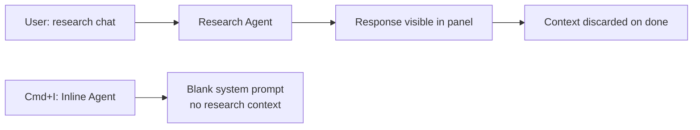
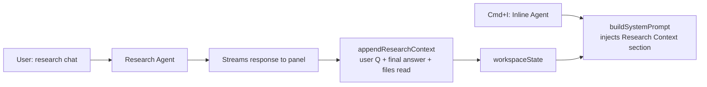

# Agent Contribution Report

## CODESPARK Research Panel in the Secondary Sidebar

### 🔴 Current behavior

```
┌─ Secondary Sidebar ─────────────────────────────────────────────┐
│  Chat  Claude Code  Codex  ▼                                    │
│ ┄┄┄┄┄┄┄┄┄┄┄┄┄┄┄┄┄┄┄┄┄┄┄┄┄┄┄┄┄┄┄┄┄┄┄┄┄┄┄┄┄┄┄┄┄┄┄┄┄┄┄┄┄┄┄┄ │
│  Type @research to use the research agent inside VS Code Chat.  │
│  No dedicated panel exists.                                     │
└─────────────────────────────────────────────────────────────────┘
```

### 🟢 New behavior

```
┌─ Secondary Sidebar ─────────────────────────────────────────────────┐
│  Chat  Claude Code  Codex  CODESPARK  ▼                            │
│ ┄┄┄┄┄┄┄┄┄┄┄┄┄┄┄┄┄┄┄┄┄┄┄┄┄┄┄┄┄┄┄┄┄┄┄┄┄┄┄┄┄┄┄┄┄┄┄┄┄┄┄┄┄┄┄┄┄┄┄ │
│                                                                     │
│                   [CODESPARK logo 250px]                           │
│               What would you like to research?                     │
│                                                                     │
│ ────────────────────────────────────────────────────────────────── │
│  User: What is this project about?                                 │
│                                                                     │
│  > ls · read · grep                          ← inline tool row     │
│                                                                     │
│  Agent: This is a VS Code extension that …   ← streamed markdown  │
│  > read · summarize                          ← next tool row       │
│  Agent: Key files include …                                        │
│                                                                     │
│ ┌──────────────────────────────────────────────────────────────┐   │
│ │ [⌫] New session                                              │   │
│ │ Ask about the codebase…                           [▶ Send]   │   │
│ └──────────────────────────────────────────────────────────────┘   │
└─────────────────────────────────────────────────────────────────────┘

Open panel:  Cmd+Shift+I  (also auto-focuses the textarea)
```

**Agent tools available in the panel:** `read`, `grep`, `find`, `ls` (read-only codebase access) + `web_search` (Brave Search API) + `web_fetch` (URL fetcher, strips HTML).

**New setting required for web search:**
```jsonc
// .vscode/settings.json
{
  "codeSpark.braveApiKey": "<your-brave-search-api-key>"
}
```

### 🤔 Assumptions
- Brave Search API key is user-supplied; no fallback web search if absent
- The `secondarySidebar` viewsContainer is a stable VS Code API (no proposed-API flags needed), confirmed by inspecting Claude Code's own `package.json`
- `marked` is an acceptable markdown renderer; no sanitisation beyond its defaults
- Preact (3 KB) is an acceptable UI dependency given the manual DOM diffing caused visible blinking and state bugs

### 🧠 Decisions
- Switched from VS Code Chat Participant API (`@research`) to a `WebviewViewProvider` — required for a first-class panel in the secondary sidebar
- Migrated webview rendering from manual DOM manipulation to Preact after incremental DOM diffing caused blinking and message-replacement bugs
- Each LLM turn (text + tool calls) renders as its own bubble; tool calls appear as a horizontal inline row between text bubbles, not a separate panel
- "New session" button always visible (disabled while streaming), not hidden
- CODESPARK header bar removed — native VS Code tab is sufficient
- Input area floats over the message list with a gradient fade; `padding-bottom` on the message list keeps last line readable above the input
- Input border: subtle panel-border when unfocused, orange (`rgb(232, 137, 12)`, matching logo) when focused; box-shadow inverted (larger when unfocused, smaller when focused)
- Last user message gets `position: sticky; top: 0` so it stays visible while scrolling through a long response

### 🔄 Discussions
- **Chat participant vs webview**: Initially implemented as a `vscode.chat.createChatParticipant` (`@research`). After the user confirmed they wanted a standalone panel like Claude Code/Codex, pivoted to `WebviewViewProvider` with `secondarySidebar`
- **`activitybar` vs `secondarySidebar`**: First implementation used `activitybar`; switched to `secondarySidebar` after discovering that is what Claude Code uses, placing the panel in the same dropdown
- **Proposed API**: User asked to enable the proposed `chatSessions` API (which puts providers in the dropdown). On inspection, Claude Code does not use it — `secondarySidebar` alone achieves the placement without any unstable APIs
- **`update_inline_context` tool**: Added as an explicit tool so the agent could signal context saves; then removed entirely in favour of automatic context extraction after each prompt (see Story 2 below)
- **Context indicator in toolbar**: Went through several iterations (`✧ No Context` / `✧ Updating…` / `✦ Context Updated`) before the user decided to drop the toolbar indicator completely once automatic context collection landed

### 🧪 Testing
- TypeScript (`npx tsc --noEmit`) and esbuild (`npm run build`) verified clean after each change
- Manual smoke-test in Extension Development Host (F5) after each visual iteration; screenshots reviewed by user
- No automated tests

### 📁 References
- [src/research-agent.ts](src/research-agent.ts)
- [src/research-view.ts](src/research-view.ts)
- [src/webview/main.tsx](src/webview/main.tsx)
- [src/webview/App.tsx](src/webview/App.tsx)
- [src/webview/state.ts](src/webview/state.ts)
- [src/webview/types.ts](src/webview/types.ts)
- [src/webview/styles.css](src/webview/styles.css)
- [src/webview/markdown.ts](src/webview/markdown.ts)
- [src/extension.ts](src/extension.ts)
- [package.json](package.json)
- [esbuild.mjs](esbuild.mjs)
- [tsconfig.json](tsconfig.json)
- [RESEARCH_AGENT_SPEC.md](RESEARCH_AGENT_SPEC.md)

---

## Research Findings Automatically Feed the Inline Code Agent

### 🔴 Current behavior

The CODESPARK research chat and the inline agent (`Cmd+I`) operate completely independently. No information flows between them.



### 🟢 New behavior

After every completed research prompt, the extension automatically appends a context block to `workspaceState`. The next `Cmd+I` invocation picks it up.



**Context appended to the inline agent's system prompt (cumulative, not replaced):**
```
### Q: What is this project about?

This is a VS Code extension that provides AI-powered inline editing…

Files referenced: src/extension.ts, src/llm-sdk.ts, package.json
```

### 🤔 Assumptions
- The inline agent context cap is 4 000 characters; older entries are implicitly truncated when the string grows beyond that
- File paths collected only from `read` tool calls, not `grep`/`find`/`ls`
- Context accumulates across sessions (stored in `workspaceState`); "New session" in the panel does not clear it

### 🧠 Decisions
- Automatic extraction is preferred over an explicit `update_inline_context` tool — the agent's natural final response is already the useful context; a dedicated tool added complexity and sometimes produced worse summaries
- Context is **appended**, not replaced, so multiple research sessions build up a richer picture for the inline agent
- Context injection is logged to the CodeSpark output channel for inspection (`Output > CodeSpark`)

### 🔄 Discussions
- **`update_inline_context` tool lifecycle**: Implemented, shipped, then removed — the user proposed and Claude agreed that auto-capturing the final response + referenced files was simpler and produced equivalent or better context without requiring the agent to remember to call a tool

### 🧪 Testing
- Manual end-to-end: ran a research prompt, then triggered `Cmd+I` and confirmed the system prompt contained the appended context block
- `npx tsc --noEmit` and `npm run build` clean

### 📁 References
- [src/research-agent.ts](src/research-agent.ts)
- [src/research-view.ts](src/research-view.ts)
- [src/llm-sdk.ts](src/llm-sdk.ts)

---

## Inline Agent Accurately Targets Cursor Position on Empty Lines

### 🔴 Current behavior

The context snippet sent to the inline agent shows the enclosing code block and the cursor's *line number*, but carries no visual marker. The model must count lines in its own context to locate the insertion point — unreliable on empty lines where there is no textual signal.

```typescript
// System prompt context (before)
"I am currently looking at this area of the file (around line 15)"

function App() {
  const [count, setCount] = useState(0);
                                   ← model must infer this blank line is line 15
  return (
    <div>...</div>
  );
}
```

### 🟢 New behavior

The exact cursor line gets a `// <-- cursor here` comment injected directly into the context snippet before it is sent to the model.

```typescript
// System prompt context (after)
"I am currently looking at this area of the file (around line 15)"

function App() {
  const [count, setCount] = useState(0);
  // <-- cursor here                    ← unambiguous, even on an empty line
  return (
    <div>...</div>
  );
}
```

### 🤔 Assumptions
- The marker is injected into the context string only, never written to disk
- The marker works for all file types (no language-specific comment syntax awareness)
- Full enclosing block is still shown; a tighter window was considered but rejected to preserve structural context

### 🧠 Decisions
- Append marker to the cursor line rather than replace it, so existing code on that line is still visible to the model

### 🧪 Testing
- Manual test: placed cursor on blank line inside a React component, triggered `Cmd+I`, confirmed the edit landed on the correct line
- `npm run build` clean

### 📁 References
- [src/editor.ts](src/editor.ts)

---

## Watch Process Auto-Terminates When Debug Session Ends

### 🔴 Current behavior

```
# Developer starts debugging
F5  →  "watch" task starts (esbuild watching extension + webview)
       … debug session runs …
Stop debugging  →  watch process keeps running in background
                   developer must kill it manually
```

### 🟢 New behavior

```
# Developer starts debugging
F5  →  "watch" task starts (esbuild watching extension + webview)
       … debug session runs …
Stop debugging  →  postDebugTask fires automatically
                   "terminate-watch" task kills the watch process
                   terminal cleans up
```

The background task detection also required a regex fix: the esbuild completion banner changed from `Watching...` to `Watching extension + webview...`, so the `endsPattern` in `tasks.json` was updated to `Watching.*\.\.\.`.

### 🤔 Assumptions
- `workbench.action.tasks.terminate` targeting the watch task label is reliable across VS Code versions tested

### 🧠 Decisions
- Used `postDebugTask` + a shell terminate task rather than `${command:workbench.action.tasks.terminate}` inline (the latter proved unreliable)

### 🧪 Testing
- Manual: stopped the debug session and confirmed the watch terminal exited automatically
- `npm run build` clean

### 📁 References
- [.vscode/launch.json](.vscode/launch.json)
- [.vscode/tasks.json](.vscode/tasks.json)
- [esbuild.mjs](esbuild.mjs)
